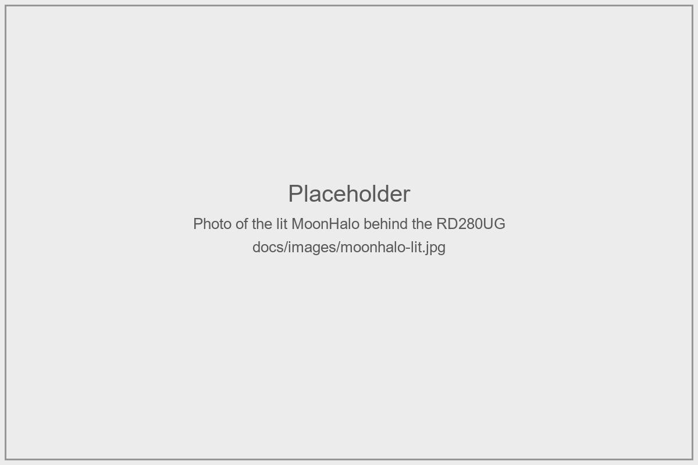
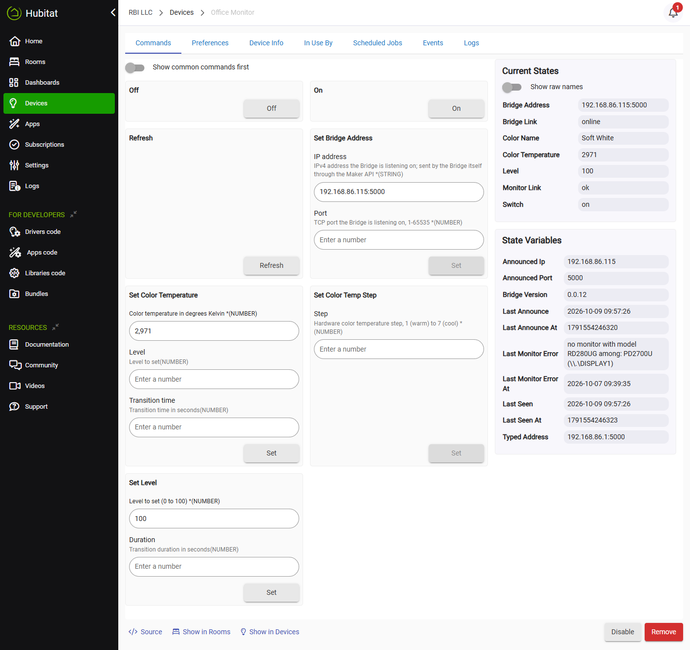
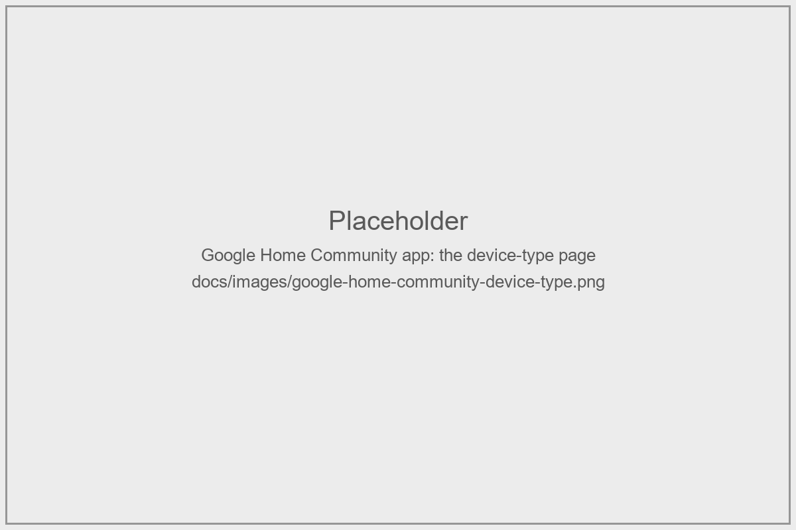
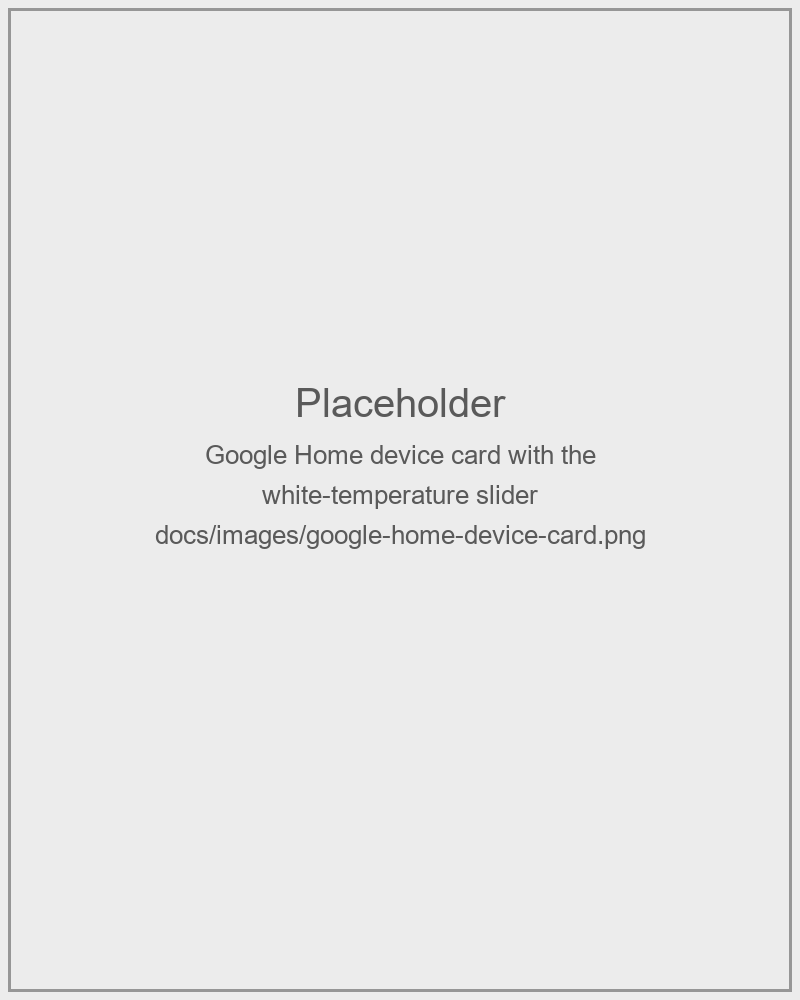

# BenQ MoonHalo Bridge

Control the MoonHalo backlight of a BenQ RD280UG monitor from Hubitat and Google Home.

## What it is

The MoonHalo is the LED backlight built into the rear of the BenQ RD280UG monitor. BenQ MoonHalo
Bridge makes it a dimmable, color-temperature light on a Hubitat Elevation hub, so rules,
dashboards and Google Home can switch it, dim it and warm or cool it like any other bulb. It has
two parts: the **Driver**, one Groovy file on the Hub, and the **Bridge**, a small Python service
on the Windows PC the monitor is plugged into. The Hub sends short HTTP requests to the Bridge
over your LAN, and the Bridge turns each one into a DDC/CI write to the monitor.



## Requirements

- **Hub**: a Hubitat Elevation hub. Tested on a C-7, platform 2.4.3.177.
- **Monitor**: a BenQ RD280UG, connected to the PC over a cable that carries DDC/CI (most
  DisplayPort and HDMI cables do). It is the only monitor tested.
- **PC**: Windows, with Python 3.12 or later installed so the `py` launcher works. Tested on
  Windows 11.
- **Network**: the Hub and the PC on the same LAN. The Hub must reach TCP port 5000 on the PC.
- **Optional**: the [Google Home Community](https://github.com/mbudnek/google-home-hubitat-community)
  app, for the white-temperature slider in Google Home.

## Install

Install the Bridge first, so the Driver has something to talk to. Each step says where it
happens. The [Bridge README](Bridges/BenQ_MoonHalo/README.md) is the full PC manual.

1. **PC** - Get the code: clone this repository, or download it as a ZIP from GitHub and unpack it.

   ```
   git clone https://github.com/RBILLC/Hubitat.git
   cd Hubitat\Bridges\BenQ_MoonHalo
   ```

2. **PC** - Install the Bridge's one dependency (Flask).

   ```
   py -m pip install -r requirements.txt
   ```

3. **PC** - Create your configuration and put your own Hub in the allowlist.

   ```
   copy config.example.json config.json
   ```

   In `config.json`, replace the example values of `allowed_ips`, `allowed_macs` and `hub_ip` with
   your Hub's IP and MAC address. The IP is on the Hub's **Settings > Hub Details** page;
   `arp -a` on the PC lists the MAC next to that IP.

4. **PC** - Check that the Bridge finds the monitor. The last line should read
   `selected: BenQ RD280UG on \\.\DISPLAYn (by edid)`.

   ```
   py -m moonhalo_bridge monitors
   ```

5. **PC** - Register the Bridge to start at logon, and start it now. The script asks for
   administrator approval, creates a scheduled task named `MoonHaloBridge` and checks that the
   Bridge answers.

   ```powershell
   .\install_task.ps1
   ```

6. **PC** - Let the Hub through Windows Firewall, replacing the address with your Hub's (details
   in the Bridge README's [Windows Firewall rule](Bridges/BenQ_MoonHalo/README.md#windows-firewall-rule)).

   ```
   netsh advfirewall firewall add rule name="MoonHalo Bridge (Hub)" dir=in action=allow protocol=TCP localport=5000 remoteip=192.168.1.10 profile=any
   ```

7. **Hub** - Import the Driver. In the Hubitat web console open **Drivers Code**, click **New
   Driver**, click **Import**, paste this URL, import, and **Save**.

   ```
   https://raw.githubusercontent.com/RBILLC/Hubitat/main/Drivers/BenQ_MoonHalo_Bridge_Driver.groovy
   ```

8. **Hub** - Create the device. Open **Devices**, click **Add Device** > **Virtual**, give it a
   name, and choose the type **BenQ MoonHalo Bridge**.

9. **Hub** - On the device's **Preferences** tab, type the PC's LAN address into **Bridge IP
   address** (the port stays 5000 unless you changed it) and click **Save Preferences**.

10. **Hub** - First-run check, on the device's **Commands** tab: click **On** and the halo lights;
    set a **Level** and it moves; under **Current States**, `bridgeLink` reads `online` and
    `monitorLink` reads `ok`.



## Usage

**On.** Lights the halo at the level it last had, rising from its lowest step. The Bridge
remembers the level; the Hub does not send one.

**Off.** Dims the halo out, then switches it off. The level and color temperature are kept for the
next On.

**Level.** `setLevel` takes 0 to 100. The halo has ten brightness levels, so it moves to the
nearest of them, while the Hub keeps showing the Level you asked for. Level 0 is Off. Setting a
level while the halo is off turns it on.

**Color temperature.** `setColorTemperature` takes Kelvin. The halo has seven color steps between
2700 K (warm) and 6500 K (cool); the Bridge picks the step the Kelvin falls in, and the Hub then
shows that step's own Kelvin, so asking for 2700 reports 2971. `setColorTempStep` sets a step, 1 to
7, directly. Setting a color temperature while the halo is off turns it on, unless color
pre-staging is enabled.

**Transitions.** Every move ramps through the halo's steps instead of jumping. A rate passed with
`setLevel` or `setColorTemperature` is the total time for that move, in seconds, so a rule that
dims over 5 seconds takes 5 seconds. Without a rate, the **Default transition (ms)** preference
sets the pace: it is the time a full brightness sweep takes, so a short move finishes sooner. Zero
snaps.

## Google Home

Share the device through the community
[Google Home Community](https://github.com/mbudnek/google-home-hubitat-community) app to get on/off,
brightness, voice control and the white-temperature slider. Hubitat's built-in Google Home app
accepts the device too, but shows no color-temperature control for any color-temperature bulb.

The step-by-step setup, with screenshots, is in the
[Google Home setup guide](docs/google-home-setup.md). In short, define a device type in the
community app:

- **Device type**: Bulb; **Google Home device type**: Light.
- **Traits**: On/Off and Brightness with their defaults; Color Setting with only **Color
  Temperature Control** set, minimum **2700**, maximum **6500**, attribute `colorTemperature`,
  command `setColorTemperature`.





The slider settles on the nearest of the halo's seven color steps after each move. Do not share
the device through both apps at once.

## Configuration reference

### Preferences

| Preference | Default | Meaning |
|---|---|---|
| **Bridge IP address** | none | IPv4 address of the PC running the Bridge. Used until the Bridge announces its own address. |
| **Bridge port** | 5000 | Port the Bridge listens on (`port` in its `config.json`). |
| **Announce timeout (seconds)** | 200 | Once the Bridge has announced its address, how long the Hub waits without an announcement or a reply before marking it offline. 0 disables the check. Keep it above the Bridge's `announce_seconds`. |
| **Request timeout (seconds)** | 5 | How long the Hub waits for the Bridge to answer a command before marking it offline. |
| **Poll interval** | 5 minutes | How often the Hub asks the Bridge for its status: disabled, or every 1, 5, 10, 15 or 30 minutes. |
| **Enable color pre-staging** | off | Accept a color temperature while the halo is off without turning it on. |
| **Default transition (ms)** | 300 | Time a full brightness sweep takes when a command carries no rate, 0 to 60000. 0 snaps. Blank leaves the pace to the Bridge's `transition_seconds`. |
| **Enable debug logging** | on | Debug lines in the hub log. Turns itself off after 30 minutes. |
| **Enable descriptionText logging** | on | One info line in the hub log per change. |

The color temperature range belongs to the Bridge: `kelvin_min` and `kelvin_max` in its
`config.json`, 2700 to 6500 by default.

Optional, when the PC's address is not fixed: the Bridge can announce its own address to the Hub
through the Maker API, so the Driver follows it across DHCP changes. See
[Letting the Hub find the Bridge](Bridges/BenQ_MoonHalo/README.md#letting-the-hub-find-the-bridge).

### Attributes

| Attribute | Values | Meaning |
|---|---|---|
| `switch` | `on`, `off` | Whether the halo is on. |
| `level` | 0 to 100 | Brightness as last commanded; 0 while the halo is off. |
| `colorTemperature` | Kelvin | The Kelvin of the current color step. |
| `colorName` | text | Hubitat's name for that Kelvin, such as Soft White. |
| `bridgeLink` | `unknown`, `online`, `offline` | Whether the Hub could reach the Bridge on its last attempt. Offline is how a halo whose PC is powered down is shown, like a bulb with no power; `switch` and `level` keep their last values. |
| `monitorLink` | `unknown`, `ok`, `failed`, `unreachable` | Whether the Bridge could talk to the monitor on its last attempt. `failed` logs one warning; commands are still sent. `unreachable` means the Bridge is offline, so its last word is not current. |
| `bridgeAddress` | `ip:port` | The address the Bridge last announced. |

The device page also shows state variables: `bridgeVersion` (the version the Bridge reports with
every reply), `lastMonitorError` and `lastMonitorErrorAt` (the last DDC/CI error and its time, kept
after recovery), `lastSeen` and `lastAnnounce` (when the Hub last heard from the Bridge), and the
announced and typed addresses.

### Commands beyond the standard ones

- `setColorTempStep(step)` - set the hardware color step, 1 (warm) to 7 (cool).
- `setBridgeAddress(ip, port)` - how the Bridge announces its address through the Maker API. It
  can also be run by hand to point the Driver at an address.

## What runs on the PC

The Bridge is the only part that runs outside the Hub, and it is small enough to read: plain
Python in [`Bridges/BenQ_MoonHalo/moonhalo_bridge`](Bridges/BenQ_MoonHalo/moonhalo_bridge), with
Flask as its one dependency and no third-party executable.

- **It listens on one port**, TCP 5000 by default, for HTTP GET requests from the Hub.
- **It answers only its allowlist.** A caller must match the Hub's IP address or its MAC address
  (resolved through the PC's own ARP table), both set in `config.json`. Anyone else on the network gets a 403.
  Requests from the PC itself are allowed by default, for testing (`allow_loopback`), and
  `/health`, which reports the version and changes nothing, skips the check.
- **It writes to one monitor.** The Bridge finds the RD280UG by its EDID identity and writes the
  MoonHalo's two VCP registers on it: one for power, one shared by brightness and color
  temperature. It touches no other monitor setting and no other monitor.
- **Nothing leaves the LAN.** The Bridge makes no internet connection and sends no telemetry.
- **It runs as you, at logon.** Windows services run in session 0, where the display functions
  are not documented to work, so the Bridge runs as a scheduled task in your own logged-in session, without
  administrator rights. It starts at logon and stops at logoff.
- **The address announcement is optional.** If you give it a Maker API token, the Bridge calls one
  command on one device on your Hub to report its own address. The token stays in `config.json`
  on the PC and never appears in the log. Without it, the Bridge makes no outgoing calls at all.

It keeps two files next to its code: `state.json`, the last level and color step, and
`bridge.log`, a line per request and per set of monitor writes.

## Known limits and troubleshooting

- **Ten brightness levels and seven color steps.** These are the monitor's own; a long transition
  shows the steps.
- **Windows only.** The Bridge uses the Windows monitor API.
- **The halo follows the PC and the monitor.** With the PC off or nobody logged in, `bridgeLink`
  reads `offline`. While the monitor sleeps, commands are refused and `monitorLink` reads `failed`,
  and the switch keeps its value; the next command after the monitor wakes works with no restart.
- **The RD280UG is the only tested monitor.** Another MoonHalo monitor may work once its EDID
  product code is set as `monitor_product` in `config.json`; `py -m moonhalo_bridge monitors`
  prints the code.

When something does not work, start with the
[troubleshooting table](Bridges/BenQ_MoonHalo/README.md#troubleshooting) in the Bridge README. It
is keyed by what the device page and `bridge.log` show.

## Versions

| Part | Current version |
|---|---|
| Driver | 0.0.17 |
| Bridge | 0.0.12 |

The Driver and the Bridge are versioned separately, and each moves only when it changes. The
Driver names the oldest Bridge it can work with, currently 0.0.9. It shows the Bridge's version on
the device page as `bridgeVersion`, and flags a Bridge that is too old there and with one warning
in the hub log. A Bridge newer than the Driver always works. Release notes are on
[GitHub Releases](https://github.com/RBILLC/Hubitat/releases).

To update later: re-import the Driver from the same URL on the Hub; on the PC, pull the new code
and restart the task (`schtasks /end /tn MoonHaloBridge`, then `schtasks /run /tn MoonHaloBridge`).

## Support

- **Questions and discussion**: the release thread on the Hubitat community forum,
  PLACEHOLDER-FORUM-THREAD-URL.
- **Bugs**: [GitHub Issues](https://github.com/RBILLC/Hubitat/issues).
- **Website**: PLACEHOLDER-WEBSITE-URL.

This is a community driver. It is not supported by Hubitat or by BenQ.

## License

MIT. See [LICENSE.txt](LICENSE.txt).

---

Also in this repository: a Tuya TS0601 soil moisture sensor driver
([`Drivers/Tuya_TS0601_Soil_Sensor_Driver.groovy`](Drivers/Tuya_TS0601_Soil_Sensor_Driver.groovy)),
a fork carried alongside; see [its forum thread](https://community.hubitat.com/t/156841).
